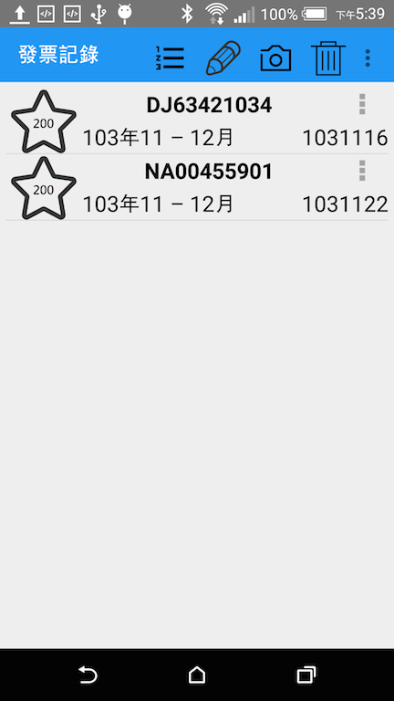
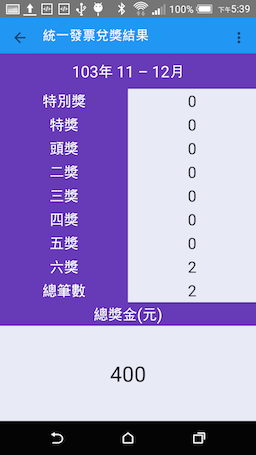

##聲明
---
###本作品只提供研究和研討之用途使用,不提供任何營利用途之使用.
 

##簡介
---
###利用QRCode掃描發票,或者沒有QRCode手動輸入,從[統一發票](http://invoice.etax.nat.gov.tw/)網站取得中獎號碼來兌獎,並顯示對獎結果。

 

 
##使用
---
###利用 git clone ,再使用Android Studio用open an existing Android Studio project開啓專案。

 
##參考
---
###[Jsoup](http://jsoup.org/)